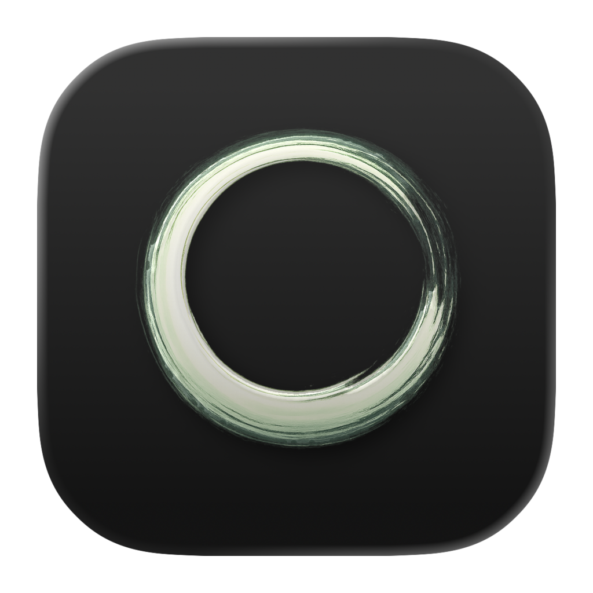

  
  <h1>ZenNotes</h1>
  
<strong>Keyboard-first local Markdown notes with Vim motions, diagrams, and first-party MCP integration.</strong>

  
Plain files. Fast editing. AI tools working directly against the same vault.

  

    <a href="https://github.com/ZenNotes/zennotes/releases/latest">Download Latest Release</a>
    ·
    <a href="https://github.com/ZenNotes/zennotes">Main Repository</a>
    ·
    <a href="https://github.com/ZenNotes/zennotes/issues">Report an Issue</a>
  

---

  ZenNotes keeps your notes as ordinary local Markdown files and layers on preview and split workflows,
  math and diagram rendering, tasks and tags, and a bundled MCP server for Claude Code, Claude Desktop, and Codex.

## What Ships Today

- Plain-file vaults with `inbox`, `quick`, `archive`, and `trash`
- Fast markdown editing with Vim mode and remappable shortcuts
- Preview and split workflows with KaTeX, Mermaid, TikZ, JSXGraph, and function-plot
- Tags, tasks, search, backlinks, and local attachments
- Built-in MCP installation flows for Claude Code, Claude Desktop, and Codex

## Get ZenNotes

- [Latest release downloads](https://github.com/ZenNotes/zennotes/releases/latest)
- [Source code](https://github.com/ZenNotes/zennotes)
